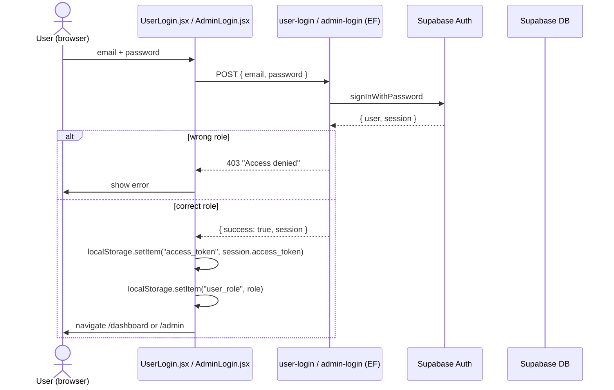

# API — Auth Flow

## Session storage

* The session is persisted in `localStorage` (not httpOnly cookies).
* `localStorage` keys used (per code):
  * `access_token` — the JWT.
  * `user_role` — `"user"` or `"admin"`.
  * `user_id` — the auth user id.
  * `user_email` — for the navbar.
  * `adminActiveTab` — last selected admin tab.
  * `currentRoute` — debug / navigation cache.
  * `showPhone`, `showEmail`, etc — boolean string. **But** the dashboard also keeps its own `userData.show_phone` etc. The two never sync (see `docs/improvements.md`).

## Logout

* **No dedicated `/auth/logout` Edge Function.** The frontend simply `localStorage.clear()` (in `NotActive.jsx`) or omits logout entirely (`AdminDashboard` has a `Logout` button that just `setActiveTab('dashboard')` and clears state — see the file for details).
* The Supabase session is **not** revoked server-side.
