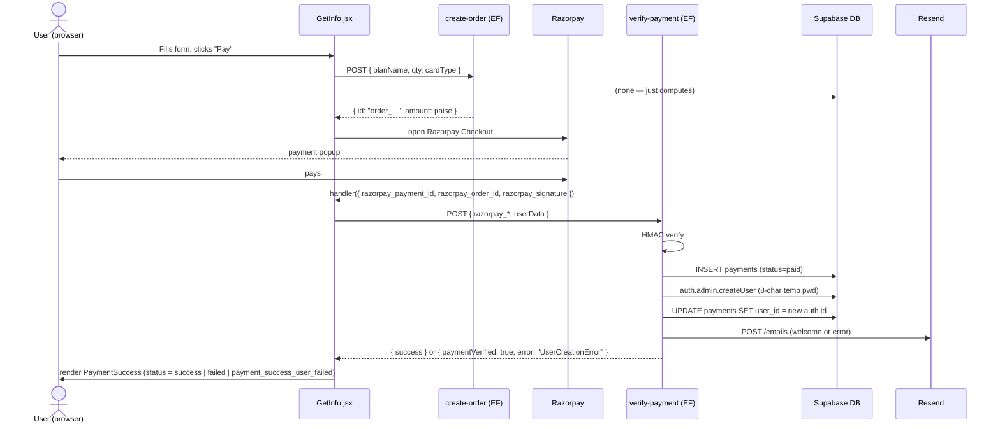

# API — Payment Flow (end-to-end)

## Failure modes

| Stage | Failure | User sees |
|-------|---------|-----------|
| `create-order` | Invalid card/plan/qty | 400, frontend shows raw error. |
| Razorpay popup | User closes | Nothing — return to form. |
| Razorpay payment | Bank declined | Razorpay shows error. Frontend `e.error.metadata` is not handled. |
| `verify-payment` HMAC mismatch | Tampered signature | 400 `"Invalid Signature"`. Frontend status `failed`. |
| `verify-payment` Auth createUser fails | Email collision / Supabase down | `payment_success_user_failed` — user is told to contact support. The `payments` row exists but `user_id` is null. |
| Resend | No API key | Welcome email not sent, but function returns success. |
| Webhook | `payment.captured` event fires | **Second `payments` row** with a different shape. |
