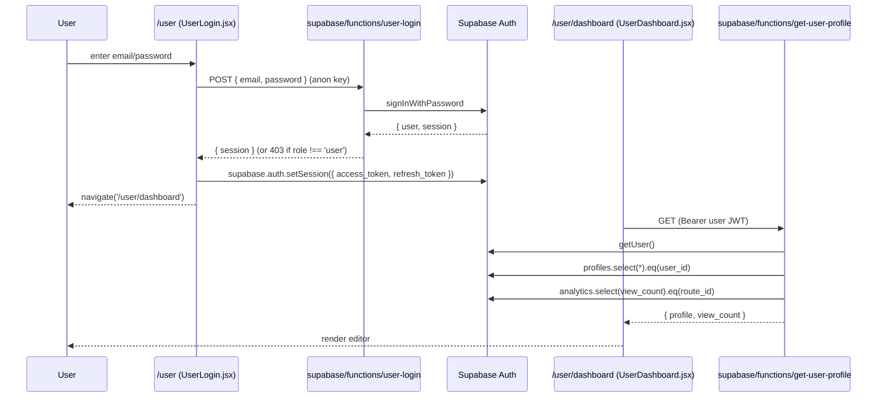
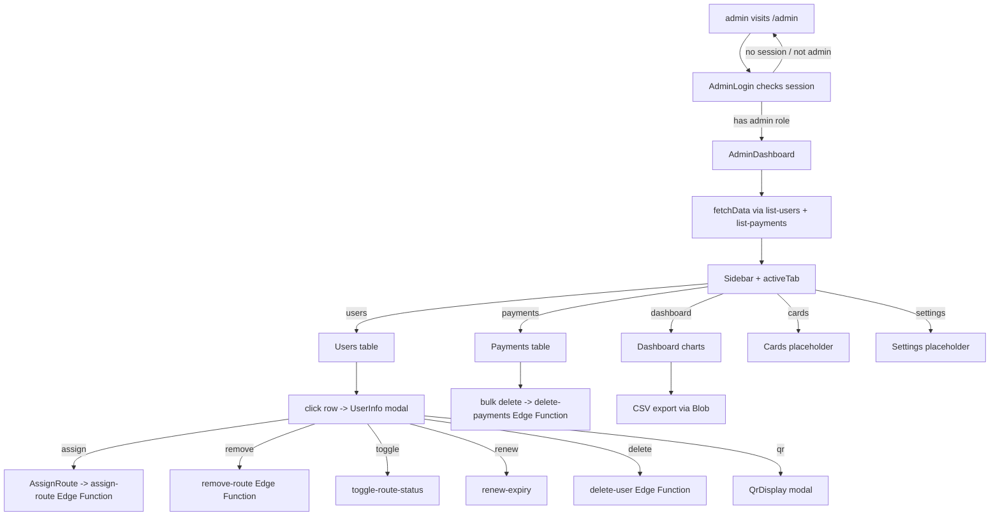
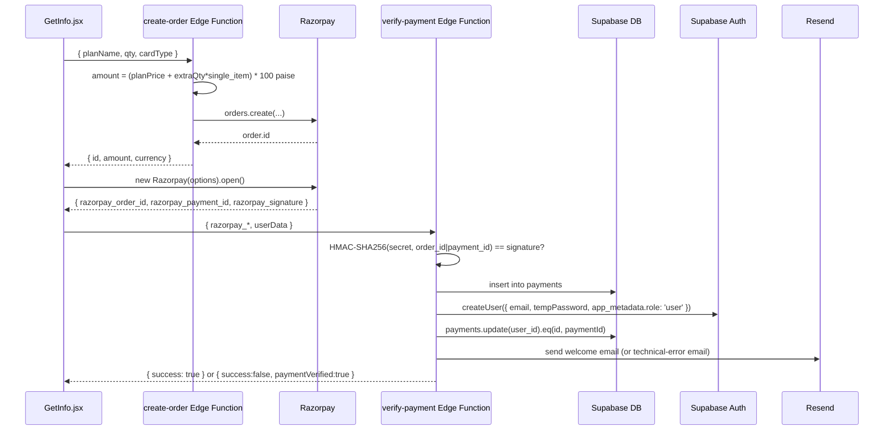

# Application Flow

End-to-end description of what happens when a user opens the app, makes a purchase, manages their profile, or when an admin logs in.

## 1. Startup Flow

1. Browser loads `index.html` from Vercel / local dev server.
2. `<div id="root">` is empty.
3. `index.html` `<script type="module" src="/src/main.jsx">` runs.
4. `src/main.jsx` imports `./index.css` (Tailwind), `App.jsx`, wraps it in `BrowserRouter`, and mounts the React tree on `#root`.
5. `App.jsx` defines the route table and lazy-loads every page except the landing page. The Suspense fallback is `PageLoader` (a centered `ThreeDot`).
6. Routing decision (URL → page):
   * `/` → `LandingPage`
   * `/user` → `UserLogin`
   * `/user/dashboard` → `UserDashboard`
   * `/admin` → `AdminLogin`
   * `/admin/dashboard` → `AdminDashboard`
   * `/{slug}` (anything else non-static) → `PublicUserPage`
   * `/getinfo` → `GetInfo`
   * `/privacy-policy` | `/terms-of-service` | `/cookie-policy` → static legal pages
   * `/forgot-password` | `/update-password` → password recovery
   * everything else → `NotFound`
7. `vercel.json` rewrites every non-asset, non-`.glb` request to `/` so the SPA routing works on production.

## 2. Visitor Flow (no account)

1. Lands on `/`.
2. Scrolls through animated sections (Hero → Services → Features → Pricing → About → Footer).
3. The floating **Chatbot** button wakes up the n8n webhook on mount and becomes clickable.
4. Clicks **Get Started** or **Order Now** → navigated to `/getinfo`.
5. Fills form, picks PVC / Wooden / Metal + 1y / 2y / 3y plan, sets qty.
6. Hits **Proceed to Payment** → frontend calls `create-order` Edge Function → Razorpay checkout modal opens.
7. On Razorpay success → frontend calls `verify-payment` Edge Function with signature.
8. The `PaymentSuccess` overlay cycles through `verifying` → `success` / `failed` / `payment_success_user_failed`.
9. On `success`, the user is invited to WhatsApp Pixiic to design their card.
10. They will receive an email (Resend) with a temp password (8 chars).
11. After admin manually assigns a route, the user logs in at `/user` and can edit their profile.

## 3. User Authentication Flow



Admin login uses the parallel `admin-login` Edge Function which checks `app_metadata.role === 'admin'`.

## 4. Public Profile View (the most important page)

```mermaid
sequenceDiagram
  participant V as Visitor
  participant R as React Router
  participant P as /:slug (PublicUserPage.jsx)
  participant SV as supabase.from('public_profiles')
  participant U as UserView.jsx

  V->>R: GET /my-slug
  R->>P: render with params.slug = 'my-slug'
  P->>SV: select *, routes!inner(route_id, is_active, expiry_date)
        .eq(route_id, 'my-slug')
        .eq('routes.is_active', true)
        .gte('routes.expiry_date', today)
        .single()
  alt found
    SV-->>P: profile row
    P->>U: <UserView user={profile} />
    P-)supabase.functions.invoke('increment-view-count', { body: { route_id: 'my-slug' } })
  else not found
    SV-->>P: error / no data
    P-->>V: <UserNotFound />
  end
```

`UserView` resolves the theme, hides fields the owner has marked private, builds the social links with `formatUrl`, and offers a **Save Contact** button that downloads a `.vcf` (iOS) or `.csv` (Android).

## 5. User Dashboard Flow

1. `UserDashboard` mounts → checks Supabase session; if missing, navigates to `/user`; if role isn't `user`, signs out and navigates to `/user`.
2. Calls `get-user-profile` Edge Function to fetch the current profile + view count.
3. Splits the stored `designation` on `;` to separate company name.
4. Restores cropper state from `localStorage` (so a refresh does not lose crop progress).
5. Renders:
   * Header with avatar preview, view-count badge, eye icon (preview modal), user dropdown (sign out).
   * Personal info section (name, designation, company, bio).
   * Pinned contact fields (phone, email, whatsapp) via `EditableField`.
   * Social fields list (16 fields) via `EditableField`.
6. Save → builds an `updatedData` object with `show_*` flags from the visibility state and writes to `profiles` via the anon client.
7. **Avatar upload** flow:
   1. Pick file → `FileReader.readAsDataURL` → opens `react-easy-crop` modal.
   2. `getCroppedImg(cropImgSrc, croppedAreaPixels, rotation)` returns a blob URL.
   3. Convert blob → File; compress with `browser-image-compression` if > 900 KB.
   4. `uploadProfileImage(file, userId, existingImageUrl)` → deletes the old image in `profile-pictures` bucket, uploads new one with `${userId}_${timestamp}.jpg`, returns the public URL.
   5. Persist URL with a partial `updateUserProfile({ id, pr_img })` call.
8. **Preview modal** builds a `previewUser` whose `socials` map includes only fields the user has not hidden, then renders the same `UserView` used by the public page.
9. Sign out → `supabase.auth.signOut()` + `navigate('/user')`.

## 6. Admin Dashboard Flow



* `AdminDashboard` keeps `users` and `payments` arrays in state. They are re-fetched on mount and whenever a child calls `onRefresh()`.
* Active tab is persisted in `localStorage` so a refresh keeps the tab.
* Each privileged action (assign / remove / toggle / renew / delete) is done through a dedicated Edge Function rather than direct Supabase writes so the role check can happen server-side using the caller's JWT.

## 7. Payment Flow



A parallel `razorpay-webhook` Edge Function is configured but uses a different insertion shape (it sends `name` and `plan` only, with a `payments` row that does not match the column names used by `verify-payment` and `list-payments`). It is not currently the source of truth for `payments`.

## 8. Authentication Boundaries

| Caller | Edge Function | Auth check |
|--------|---------------|------------|
| Anonymous | `create-order`, `verify-payment`, `increment-view-count`, `user-login`, `admin-login`, `create-user` | None (or none enforced) |
| Admin JWT | `assign-route`, `remove-route`, `renew-expiry`, `toggle-route-status`, `list-users`, `list-payments`, `delete-payments`, `delete-user` | `app_metadata.role === 'admin'` |
| User JWT | `get-user-profile` | Authenticated user; their own `user_id` |

> Note: `verify_jwt = true` in `supabase/config.toml` for all functions, so the platform's API Gateway already enforces a valid JWT before the function runs. Some functions do an additional `auth.getUser` inside the handler to read the role; the gateway does not.

## 9. Error Handling Flow

* **Network errors** are caught in `try/catch` and surfaced to the user via `alert` or a colored inline message (`UserLogin`, `AdminLogin`, `ForgotPassword`, `UpdatePassword`).
* **Wrong credentials** → 401 from the Edge Function → thrown error → red alert.
* **Wrong role** → 403 from `user-login` / `admin-login` → red alert.
* **Payment failure**:
  * Signature mismatch → 400 with `Invalid Signature`.
  * Razorpay modal `payment.failed` → `setPaymentStatus('failed')` + `alert`.
  * Successful payment but `createUser` fails → `setPaymentStatus('payment_success_user_failed')` overlay + technical-error email.
* **Expired route** → `getUserProfileByRouteId` returns no data → `UserNotFound` page.
* **Auth token missing/expired in dashboard** → `get-user-profile` throws → `supabase.auth.signOut()` + `setNotActive(true)` → `<NotActive />` page (clears localStorage and redirects to `/user`).

## 10. Animation Flow

The landing page and most components use **GSAP timelines** registered through `gsap.registerPlugin(ScrollTrigger)` and the `useGSAP` hook from `@gsap/react`. Every section has its own `containerRef` passed as `{ scope }` to keep the selectors local. The 3D NFC animation is built directly with SVG inside `Land/NfcAnimation.jsx` (no Three.js canvas).

The `UserView` component runs an entrance animation timeline only once per mount via a `useRef('hasAnimated')` guard.
