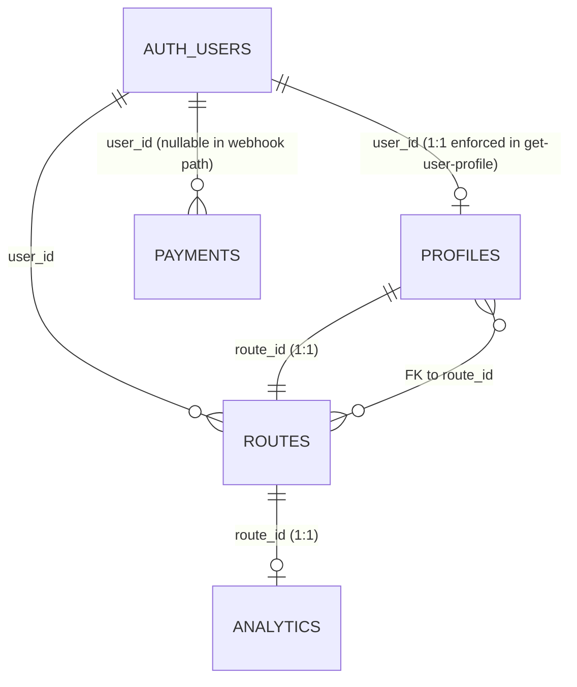

# Database — Pixiic NFC

This document describes the **inferred** schema of the Pixiic Supabase project. The repository ships **no SQL migration files** (the `supabase/migrations/` directory is empty), so the table and column descriptions below are reconstructed from the Edge Function sources, the `userService.js` queries, and the `verify-payment` insert. Use it as a working hypothesis, not a ground truth — confirm with the Supabase Studio before relying on any column.

## Top-level entities



## Table: `auth.users` (Supabase managed)

| Column | Type | Notes |
|--------|------|-------|
| `id` | uuid PK | |
| `email` | text unique | |
| `encrypted_password` | text | |
| `email_confirmed_at` | timestamptz | Set immediately by `verify-payment` (no verification email). |
| `user_metadata` | jsonb | `{ name }` — set on signup. |
| `app_metadata` | jsonb | `{ role: "user" | "admin", plan?: "1_year" | "2_year" | "3_year" }`. **Role gate** for `assign-route`, `list-users`, etc. |
| `created_at` | timestamptz | |

## Table: `profiles`

Inferred from `get-user-profile` (`select *`) and `UserDashboard.jsx` (`update` with ~30 columns).

| Column | Type | Notes |
|--------|------|-------|
| `id` | uuid PK | |
| `user_id` | uuid FK → `auth.users.id` UNIQUE | `get-user-profile` rejects >1 row. |
| `route_id` | text FK → `routes.route_id` UNIQUE | |
| `name`, `full_name` | text | Either works (UI uses `name`). |
| `designation` | text | May contain `;` for multiple roles. |
| `pr_img`, `profile_photo` | text (URL) | Either works. |
| `bio` | text | |
| `phone`, `email`, `whatsapp` | text | Visibility flags below. |
| `linkedin`, `twitter`, `instagram`, `facebook`, `youtube`, `tiktok`, `snapchat`, `pinterest`, `reddit`, `threads`, `telegram`, `whatsapp_channel`, `quora`, `tumblr`, `vk`, `wechat`, `viber`, `line`, `custom_link_1`, `custom_link_2` | text | Free-form URLs. |
| `location` | text | Encoded into a Google Maps search URL. |
| `color` | text | Theme key, e.g. `sky`, `pixiic_dark`. |
| `show_phone`, `show_email`, `show_whatsapp`, `show_linkedin`, `show_twitter`, `show_instagram`, `show_facebook`, `show_youtube`, `show_tiktok`, `show_snapchat`, `show_pinterest`, `show_reddit`, `show_threads`, `show_telegram`, `show_whatsapp_channel`, `show_quora`, `show_tumblr`, `show_vk`, `show_wechat`, `show_viber`, `show_line`, `show_custom_link_1`, `show_custom_link_2`, `show_location` | bool | Per-field visibility. |
| `created_at`, `updated_at` | timestamptz | |

> The dashboard's `update` payload is the only place where every column appears. The `select *` from the public path returns all of them — see the "RLS gap" risk in `docs/improvements.md`.

## Table: `routes`

| Column | Type | Notes |
|--------|------|-------|
| `route_id` | text PK | The slug used in `/{route_id}` URLs. |
| `user_id` | uuid FK → `auth.users.id` | **Should be UNIQUE; not enforced in code.** |
| `is_active` | bool | Default `true` after `assign-route`. |
| `last_activated` | timestamptz | |
| `expiry_date` | date (YYYY-MM-DD text) | Set to `now + 365d` on assign, bumped by `renew-expiry`. |
| `card_type` | text | `'PVC Card' | 'Wooden Card' | 'Metal Card'`. |
| `created_at` | timestamptz | Inferred. |

## Table: `analytics`

| Column | Type | Notes |
|--------|------|-------|
| `route_id` | text PK FK → `routes.route_id` | One row per route. |
| `view_count` | int | Bumped by RPC `increment_view_count(route_id_input)`. |

## Table: `payments`

Two insert paths write **different shapes** to this table — see the data-integrity risk.

| Column | Type | Inserted by `verify-payment` | Inserted by `razorpay-webhook` |
|--------|------|------------------------------|---------------------------------|
| `id` | uuid PK | ✓ | ✓ |
| `razorpay_payment_id` | text | ✓ (text) | — (`payment_id`) |
| `razorpay_order_id` | text | ✓ | — |
| `payment_id` | text | — | ✓ (Razorpay pay id) |
| `amount` | int (INR) | ✓ (recomputed from pricing) | ✓ (`entity.amount / 100`) |
| `full_name` | text | ✓ | — (uses `name`) |
| `name` | text | — | ✓ |
| `email` | text | ✓ | — |
| `phone` | text | ✓ | — |
| `address` | text | ✓ | — |
| `account_type` | text | ✓ | — |
| `company_name` | text | ✓ | — |
| `plan` | text | ✓ | ✓ |
| `card_type` | text | ✓ | — |
| `qty` | int | ✓ | — |
| `payment_status` | text | ✓ ('paid') | — (uses `paid`) |
| `paid` | bool | — | ✓ |
| `user_id` | uuid FK → `auth.users.id` | ✓ (backfilled after createUser) | — |
| `created_at` | timestamptz | ✓ | ✓ |

> The frontend `comp_views/Payments.jsx` searches by `email`, `phone`, `amount` and displays a "View on Razorpay" link. Both column name sets must be present in the actual schema, or the search/links will be broken.

## RPC: `increment_view_count(route_id_input text)`

Signature:
```sql
increment_view_count(route_id_input text) returns void
```
Implementation: should be `UPDATE analytics SET view_count = view_count + 1 WHERE route_id = $1`. The function is referenced by `increment-view-count/index.ts`. **Body not in repo** — must be defined via the Supabase SQL editor.

## View: `public_profiles`

Inferred from `userService.getUserProfileByRouteId`:
```js
supabase
  .from("public_profiles")
  .select("*, routes!inner(route_id, is_active, expiry_date)")
  .eq("routes.route_id", slug)
  .eq("routes.is_active", true)
  .gte("routes.expiry_date", todayIso)
  .maybeSingle();
```
The view likely `SELECT * FROM profiles` with RLS that filters to `is_active = true AND expiry_date >= now()`. **The `is_active`/`expiry_date` filters in the JS code are belt-and-suspenders** — they should not be needed if the view is correct.

## Row-Level Security (RLS) — best guess

| Table | SELECT | INSERT | UPDATE | DELETE |
|-------|--------|--------|--------|--------|
| `auth.users` | (managed) | (managed) | (managed) | (managed) |
| `profiles` | self (via Edge Function) | admin | self | admin |
| `routes` | self | admin | admin | admin |
| `analytics` | self | RPC | RPC | none |
| `payments` | admin | verify-payment (service) | none | admin |
| `public_profiles` (view) | anon | n/a | n/a | n/a |

> `verify-payment` uses the **service role key** to bypass RLS for both inserts and the Auth `createUser`. That key is in `Deno.env.get("SUPABASE_SERVICE_ROLE_KEY")` and never reaches the browser.

## Migrations

* `supabase/migrations/` is **empty**. The schema is managed out-of-band (likely the Supabase SQL editor or a private repo).
* `supabase/seed.sql` does not exist (referenced in `config.toml` but the file is missing).

## Risks

* Three sources of pricing truth.
* Two payment-insert shapes (`verify-payment` vs `razorpay-webhook`).
* `routes.user_id` is not UNIQUE — `assign-route` could create duplicates.
* No soft-delete / no `deleted_at` columns anywhere.
* The view `public_profiles` may bypass the per-field `show_*` flags because the JS query selects `*` from the view.
