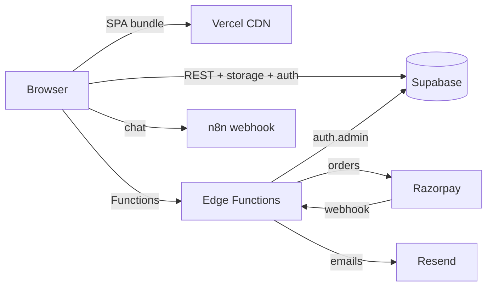
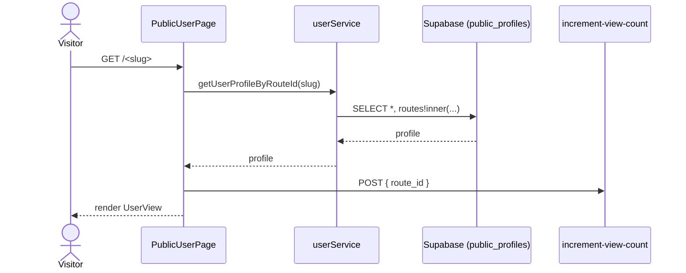
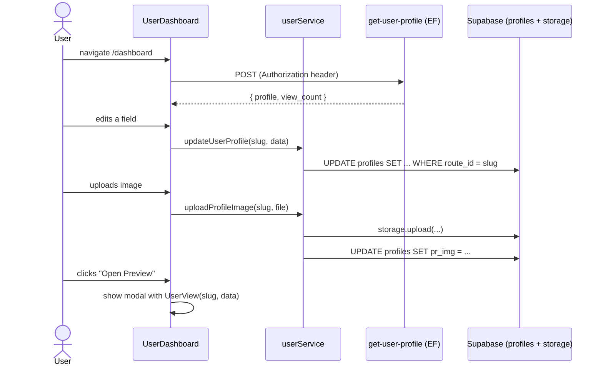
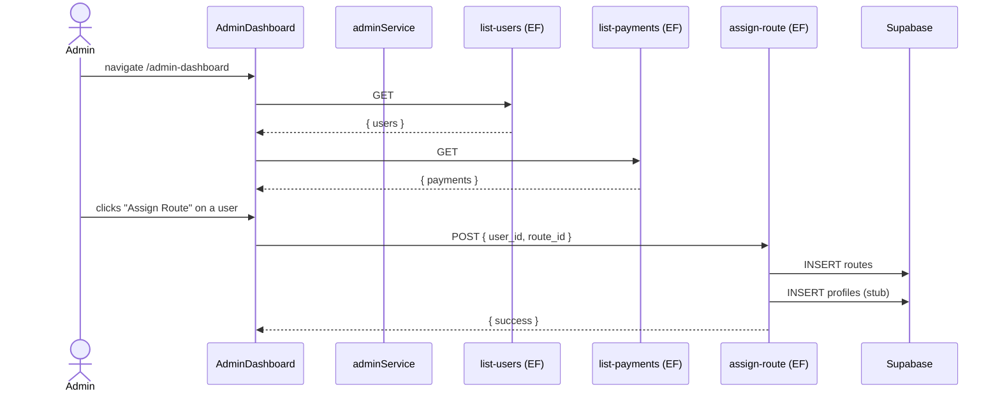
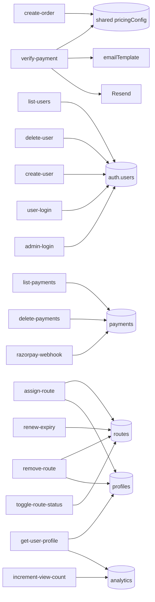

# Diagrams

A collection of Mermaid diagrams that describe the system. Each diagram is also reproduced inline in the relevant docs.

## Index

* [01 — Top-level architecture](#01)
* [02 — Public user page flow](#02)
* [03 — User dashboard flow](#03)
* [04 — Admin dashboard flow](#04)
* [05 — Payment / order flow](#05)
* [06 — Database ER](#06)
* [07 — Edge Function dependencies](#07)

## 01 — Top-level architecture

## 02 — Public user page flow

## 03 — User dashboard flow

## 04 — Admin dashboard flow

## 05 — Payment / order flow

See [api/payment-flow.md](../api/payment-flow.md).

## 06 — Database ER

See [database/schema.md](../database/schema.md).

## 07 — Edge Function dependencies

