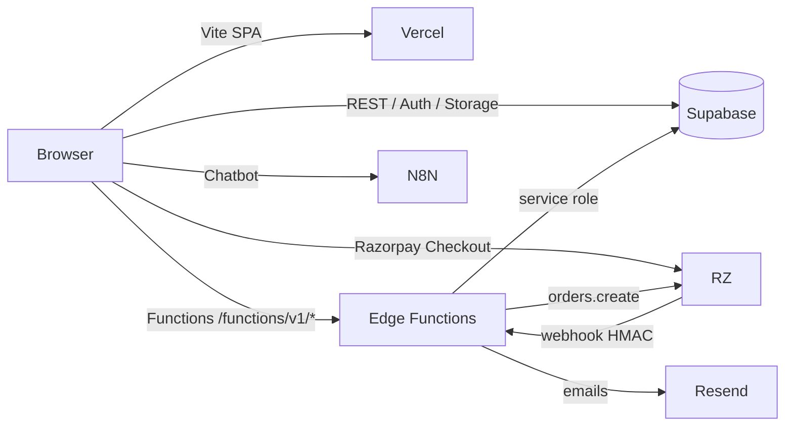

# Pixiic NFC — Developer Documentation

This is the **single entry point** for everything in the Pixiic NFC business card platform. Read top-to-bottom if you're new; jump to the section you need otherwise.

> **Project status (Jan 2026):** working MVP. Public profile, Razorpay payment, admin dashboard, and 16 Edge Functions are deployed. **No SQL migrations are committed** — the schema is managed out-of-band. Several P0 issues are open; see [`improvements.md`](improvements.md).

## Project Summary

Pixiic sells **NFC-enabled business cards** in India. A user pays on the website → receives a physical PVC / Wooden / Metal card → scans it with a phone → lands on a public profile page (`https://pixiic.com/<slug>`) that displays their social links, contact info, and a "Save Contact" button.

Three front-end experiences:
* **Landing** (`/`) — marketing, pricing, chatbot.
* **User dashboard** (`/dashboard`) — edit profile, change theme, manage visibility.
* **Admin dashboard** (`/admin-dashboard`) — list users + payments, assign routes, suspend.

Two back-end tiers:
* **Supabase** — Postgres, Auth, Storage, RLS.
* **Supabase Edge Functions** — 16 Deno-served functions for everything sensitive (payments, admin actions, Auth wrappers).

A small set of **external services** rounds it out: **Razorpay** for payments, **Resend** for transactional email, **n8n** for the chatbot.

## Tech Stack

| Layer | Tech | Version |
|-------|------|---------|
| Frontend framework | React | 19.0.0 |
| Routing | react-router-dom | 7.1.5 |
| Build | Vite | 6.0.7 |
| Styling | Tailwind CSS | 4.0.6 |
| State | None (local `useState` + `localStorage`) | — |
| Animation | GSAP + `@gsap/react` | 3.13.0 / 2.1.2 |
| Icons | lucide-react + @fortawesome/react-fontawesome | various |
| Data viz | recharts | 2.15.0 |
| QR | qrcode | 1.5.4 |
| HTTP | supabase-js | 2.49.4 |
| Payments | Razorpay (loaded via CDN script in `GetInfo.jsx`) | — |
| Backend | Supabase Edge Functions (Deno) | Deno 1.x |
| Email | Resend (HTTPS) | — |
| Bot | n8n webhook | — |
| Deployment | Vercel (SPA rewrites) | — |

## Architecture Summary



* **No long-running backend.** Every "backend" task is a one-shot Deno isolate.
* **No shared state.** Frontend state is per-page; backend state is in Supabase.
* **Auth is wrappered.** The browser does not call `supabase.auth.signInWithPassword` directly; it calls `user-login` / `admin-login` Edge Functions which validate the role server-side.

For more: [`architecture/project-overview.md`](architecture/project-overview.md).

## Folder Map

```
infynk-v1/
├── docs/                  ← you are here
├── public/                ← static assets served from /
├── src/                   ← Vite SPA source
│   ├── components/        ← reusable UI (comp_views/ is the admin tabs)
│   ├── crop/              ← avatar crop helper
│   ├── landing-components/← (dead) Navbar.jsx
│   ├── pages/             ← route elements
│   │   ├── Land/          ← landing sections
│   │   └── legal/         ← privacy / terms / cookies
│   ├── services/          ← data access layer (supabaseService, userService, adminService, themes, generateVCard)
│   ├── App.jsx            ← route table
│   ├── main.jsx           ← ReactDOM root
│   ├── supabaseClient.js  ← anon client singleton
│   ├── Home.jsx, UserControl.jsx  ← dead boilerplate
│   ├── index.css, App.css ← styles
│   └── assets/            ← logo SVGs
├── supabase/
│   ├── config.toml        ← local dev config + 11 function registrations (5 are missing)
│   └── functions/         ← 16 Deno-served functions + _shared/pricingConfig.ts
├── package.json
├── vite.config.js
├── vercel.json
├── eslint.config.js
├── index.html
└── .env                   ← gitignored
```

For more: [`architecture/folder-structure.md`](architecture/folder-structure.md).

## Documentation Tree

### Architecture
* [`architecture/project-overview.md`](architecture/project-overview.md) — what Pixiic is and how the pieces fit.
* [`architecture/folder-structure.md`](architecture/folder-structure.md) — annotated tree.
* [`architecture/application-flow.md`](architecture/application-flow.md) — request/response flow per major feature.
* [`architecture/dependency-map.md`](architecture/dependency-map.md) — who imports / calls whom.

### File-by-file (`docs/files/`)
Every source file has its own doc. Use this for deep dives.

* **Bootstrap & config:** `index-html.md`, `main-jsx.md`, `App-jsx.md`, `index-css.md`, `App-css.md`, `supabaseClient.md`, `supabase-config.md`, `asset-logo.md`, `asset-logo-favicon.md`, `asset-logo-favicon-nb.md`.
* **Services:** `supabaseService.md`, `userService.md`, `adminService.md`, `themes.md`, `generateVCard.md`, `cropUtils.md`.
* **Pages:** `LandingPage.md`, `PublicUserPage.md`, `UserLogin.md`, `UserDashboard.md`, `AdminLogin.md`, `AdminDashboard.md`, `GetInfo.md`, `SuccessPage.md`, `TestPaymentPage.md`, `NotFound.md`, `UserNotFound.md`, `ForgotPassword.md`, `UpdatePassword.md`, `getInfo-css.md`.
* **Landing sections:** `Navbar-landing.md`, `NfcAnimation.md`, `Services.md`, `Features.md`, `Pricing.md`, `About.md`, `Footer.md`.
* **Legal pages:** `PrivacyPolicy.md`, `TermsOfService.md`, `CookiePolicy.md`.
* **Components:** `Chatbot.md`, `EditableField.md`, `Header-component.md`, `Notactive.md`, `PaymentSuccess.md`, `Sidebar.md`, `Spinner.md`, `ThemeColorPicker.md`, `UserView.md`.
* **Admin tabs:** `comp_views-Dashboard.md`, `comp_views-Users.md`, `comp_views-UserList.md`, `comp_views-UserInfo.md`, `comp_views-AssignRoute.md`, `comp_views-QrDisplay.md`, `comp_views-Payments.md`, `comp_views-Cards.md`.
* **Edge Functions:** `edge-verify-payment.md`, `edge-get-user-profile.md`, `edge-assign-route.md`, `edge-create-order.md`, `edge-user-login.md`, `edge-admin-login.md`, `edge-increment-view-count.md`, `edge-list-users.md`, `edge-list-payments.md`, `edge-delete-user.md`, `edge-delete-payments.md`, `edge-renew-expiry.md`, `edge-toggle-route-status.md`, `edge-remove-route.md`, `edge-razorpay-webhook.md`, `edge-create-user.md`, `edge-pricing-config.md`, `edge-email-template.md`.

### Database
* [`database/schema.md`](database/schema.md) — inferred schema, ER diagram, RPC.
* [`database/migrations.md`](database/migrations.md) — the missing migration story.
* [`database/rls.md`](database/rls.md) — row-level security access patterns.

### API
* [`api/endpoints.md`](api/endpoints.md) — full Edge Function catalog.
* [`api/payment-flow.md`](api/payment-flow.md) — sequence diagram + failure modes.
* [`api/auth-flow.md`](api/auth-flow.md) — login flow + session storage.

### Frontend
* [`frontend/component-tree.md`](frontend/component-tree.md) — Mermaid tree.
* [`frontend/routing.md`](frontend/routing.md) — route table.
* [`frontend/state-management.md`](frontend/state-management.md) — per-page state + the localStorage bug.
* [`frontend/hooks-and-effects.md`](frontend/hooks-and-effects.md) — every `useEffect` and GSAP timeline.

### Backend
* [`backend/architecture.md`](backend/architecture.md) — Deno edge runtime, auth patterns.
* [`backend/environment.md`](backend/environment.md) — env vars and the `.env` leak risk.
* [`backend/shared-pricing.md`](backend/shared-pricing.md) — `_shared/pricingConfig.ts`.

### Diagrams
* [`diagrams/index.md`](diagrams/index.md) — every Mermaid diagram in one place.

### Risks & TODOs
* [`improvements.md`](improvements.md) — full risk register with file:line references. **Read this before any refactor.**

## Recommended Reading Order

1. **New to the project?** Start with this file, then [`architecture/project-overview.md`](architecture/project-overview.md), then [`architecture/application-flow.md`](architecture/application-flow.md).
2. **Touching the frontend?** [`frontend/component-tree.md`](frontend/component-tree.md) → [`frontend/routing.md`](frontend/routing.md) → the specific page doc in `docs/files/`.
3. **Touching a function?** [`api/endpoints.md`](api/endpoints.md) → the specific `edge-*.md` file.
4. **Doing a security review?** [`improvements.md`](improvements.md) → [`backend/environment.md`](backend/environment.md) → [`api/auth-flow.md`](api/auth-flow.md).
5. **Working on payments?** [`api/payment-flow.md`](api/payment-flow.md) → [`edge-verify-payment.md`](files/edge-verify-payment.md) → [`edge-razorpay-webhook.md`](files/edge-razorpay-webhook.md) → [`improvements.md`](improvements.md) (P0 #4, #5).
6. **Working on the database?** [`database/schema.md`](database/schema.md) → [`database/migrations.md`](database/migrations.md) → [`database/rls.md`](database/rls.md).

## Glossary

* **Slug / `route_id`** — the unique URL-safe identifier after `/`. e.g. `pixiic.com/jane-doe` → `route_id = "jane-doe"`.
* **Route** — a row in the `routes` table. Has `is_active`, `expiry_date`, `card_type`.
* **Profile** — a row in the `profiles` table. Joined 1:1 to a `route`. Holds the user-visible fields.
* **Public profile** — the read-only view of a profile, fetched by slug.
* **Admin** — a Supabase Auth user with `app_metadata.role === "admin"`.
* **Edge Function** — a Deno-served TypeScript function in `supabase/functions/`.
* **Service role** — the `SUPABASE_SERVICE_ROLE_KEY` that bypasses RLS. Only used by Edge Functions.
* **Anon key** — the public `VITE_SUPABASE_ANON_KEY` in the Vite bundle. Subject to RLS.

---

> Found a bug in the docs or the code? Open an issue and tag it with the file path. The full list of known issues is in [`improvements.md`](improvements.md).
